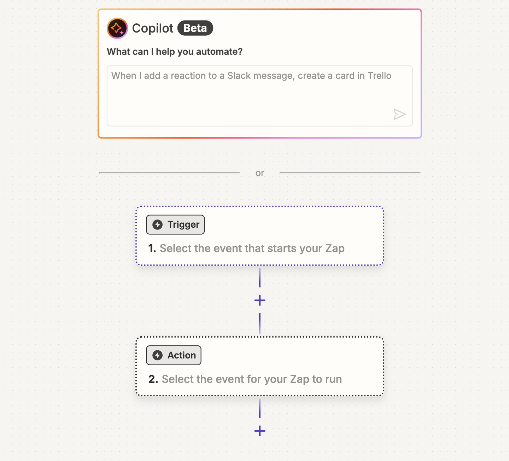
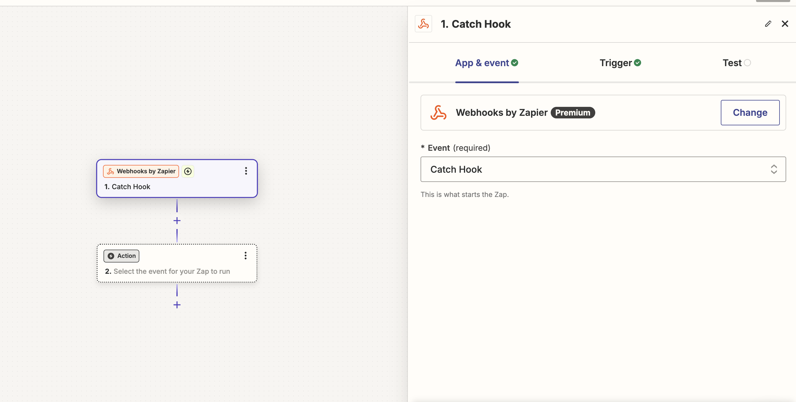
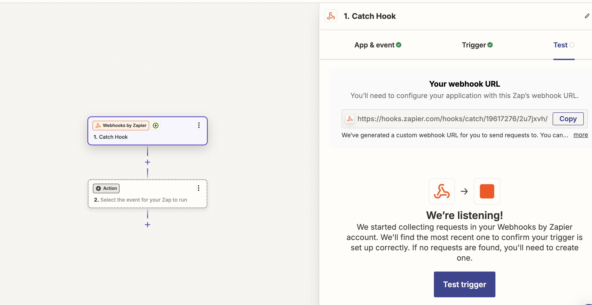

# Creating a Custom GPT to Send WhatsApp Messages with Zapier and 2Chat

In today’s digital age, instant communication is vital. WhatsApp, with its vast user base, has become a preferred communication tool for many businesses and individuals. 

In this, I’ll guide you through the process of creating a custom GPT that sends WhatsApp messages to both individuals and groups using Zapier and 2Chat. This powerful integration will enable seamless and automated messaging, enhancing your communication capabilities.

## Why Use Custom GPT for WhatsApp Messaging?

Custom GPTs, powered by OpenAI’s technology, provide a flexible and intelligent way to handle various tasks. Integrating a custom GPT with WhatsApp allows you to automate messages, provide instant responses, and manage group communications efficiently. This setup is handy for businesses looking to improve customer service, send reminders, or manage group communications.

## Prerequisites

Before we dive into the process, ensure you have the following:

	1.	ChatGPT Plus Account: To access and create your custom GPT.
	2.	Zapier Account: To automate workflows and connect different apps.
	3.	2Chat Account: To handle WhatsApp messaging.
	4.	Basic Knowledge of Python: To write some basic scripts.

---

# 1. Setting Up Your Custom GPT
To begin setting up your custom GPT, follow these steps:

1. Log in to Your ChatGPT Plus Account:
 - Open your web browser and navigate to https://chatgpt.com/
 - Log in using your GPT-4 Plus account credentials.

2. Access the Custom GPTs Section
Once logged in, click on your profile avatar icon located in the top-right corner of the page.
From the dropdown menu, select the “My GPTs” option.

3. Create a New GPT:
 - Click on the “Create a GPT” option.
 - You will be redirected to the GPT editor at https://chatgpt.com/gpts/editor.

5. Configure Your Custom GPT:
   - **Name** Your GPT: Enter a meaningful name for your custom GPT, such as “WhatsApp Message Assistant”.
   - **Description:** Provide a brief description of your GPT’s purpose. For example, “Send inbox WhatsApp messages to individuals.”
   - **Instructions:** Define clear instructions for your GPT. This could include specific prompts or guidelines to ensure the generated messages meet your requirements
For instance, you might add:
	
 `You are a custom GPT designed to send messages to my WhatsApp inbox through Zapier. This GPT will call a Zapier webhook and send data to that webhook, including the recipient's phone number and the message to be sent.`

---

# 2. Setting Up Zapier for Integration

After configuring your custom GPT, the next step is to set up Zapier to automate the process of sending WhatsApp messages. Follow these steps:

 - Sign Up on Zapier: https://zapier.com/
 - Open the Zapier Dashboard: This is where you can create and manage your Zaps (automated workflows).
 - Open Zaps tab: located at the left menu.

---

- #### Create a New Zap: Click on the “Create” button, this will start the process of creating a new automated workflow.
  

---

#### Once new Zap windows open then you have two options on screen first one will be Trigger and the second will be Action

---

### Configure the Trigger:
 - In the “Choose App & Event” section, select the app that will trigger the workflow. For example, you might choose “Webhook” if you’re triggering the workflow via a webhook from your custom GPT.
 - Event: Select the event that will trigger the Zap. For webhooks, you can select “Catch Hook” to capture data sent to a unique URL.
 - Click “Continue” and follow the instructions to set up and test your trigger.
 - copy this URL your GPT will use this to call your Zaiper's Zap

  1
  
  2

- before setting the next action on Zaiper you have to set up your 2chat account

#  3. Setting Up Your 2Chat Account
 - Sign Up on 2Chat  https://app.2chat.io/
 - Open the 2Chat Dashboard
 - Click on the “Channels” tab in the dashboard
